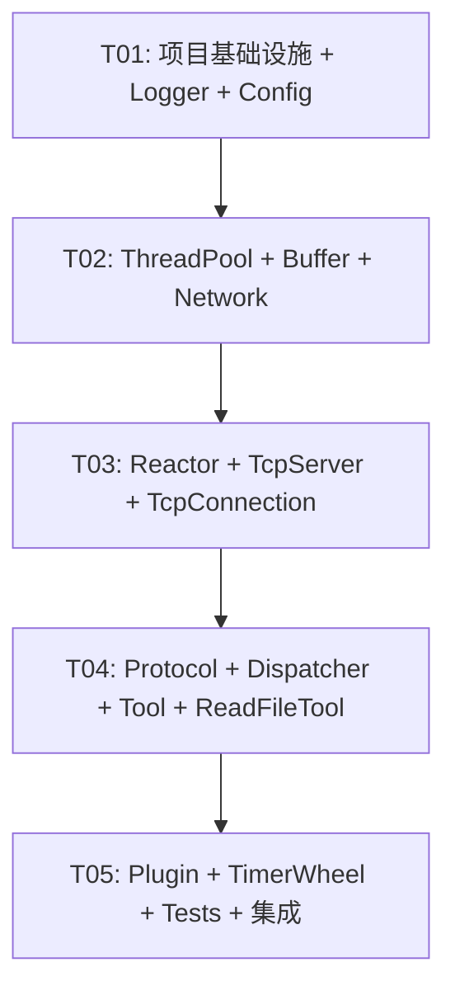

# SolarMcp — 系统架构设计文档

> **版本**: v1.0  
> **作者**: Bob (Architect)  
> **日期**: 2026-06-22  

---

## 目录

- [Part A: 系统设计](#part-a-系统设计)
  - [1. 实现方案与框架选型](#1-实现方案与框架选型)
  - [2. 文件列表](#2-文件列表)
  - [3. 数据结构与接口（类图）](#3-数据结构与接口类图)
  - [4. 程序调用流程（时序图）](#4-程序调用流程时序图)
  - [5. 待明确事项](#5-待明确事项)
- [Part B: 任务分解](#part-b-任务分解)
  - [6. 依赖包列表](#6-依赖包列表)
  - [7. 任务列表](#7-任务列表)
  - [8. 共享知识](#8-共享知识)
  - [9. 任务依赖图](#9-任务依赖图)

---

## Part A: 系统设计

### 1. 实现方案与框架选型

#### 1.1 总体架构概览

```
┌─────────────────────────────────────────────────────────────────┐
│                         SolarMcp Server                          │
├─────────────────────────────────────────────────────────────────┤
│  main()                                                         │
│    ├── ConfigManager::loadFile("config.yaml")                   │
│    ├── Logger::init(ConfigManager::get("logging"))               │
│    ├── ThreadPool pool(config.threads)                           │
│    ├── PluginManager::loadPlugins(config.plugin_dir)             │
│    ├── ToolManager::registerTools(plugins)                       │
│    ├── Dispatcher::registerMethod("tools/list", ...)            │
│    ├── Dispatcher::registerMethod("tools/call", ...)            │
│    ├── TcpServer server(config.host, config.port, &loop)       │
│    │     ├── onMessage: Codec::decode → Dispatch → Tool → Reply │
│    │     └── onConnection: Accept → Buffer → Channel            │
│    └── EventLoop::loop()  // 主循环                              │
└─────────────────────────────────────────────────────────────────┘
```

#### 1.2 关键设计决策

| 决策点 | 选择 | 理由 |
|--------|------|------|
| **C++ 标准** | C++20 | `std::format`、`std::source_location`、`std::span`、concepts |
| **构建系统** | CMake ≥ 3.20 | 跨平台、行业标准、FetchContent 支持 |
| **网络 I/O 模型** | epoll + 非阻塞 I/O | Linux only，高性能 Reactor 模式 |
| **Reactor 结构** | Main Reactor + Worker Reactor（P0 单 Reactor，P1 多 Reactor） | P0 简化实现，架构预留扩展点 |
| **线程模型** | IO 线程 + ThreadPool 业务线程分离 | 避免 IO 线程被业务阻塞 |
| **JSON 库** | nlohmann/json (≥ 3.11) | 最流行的 C++ JSON 库，header-only，语法优雅 |
| **日志模式** | 双缓冲异步日志 | 前端低延迟 push，后端批量写盘 |
| **定时器** | 时间轮（TimerWheel） | O(1) 插入/删除，适合大量定时器场景 |
| **插件加载** | dlopen + dlsym | POSIX 标准，无需额外依赖 |
| **配置格式** | YAML（主）+ JSON（兼容） | 使用 yaml-cpp 解析 YAML，nlohmann/json 解析 JSON |
| **测试框架** | GoogleTest (gtest) | 行业标准，丰富的断言和 mock 支持 |
| **内存管理** | RAII + `std::unique_ptr`/`std::shared_ptr` | 零裸指针泄漏风险 |

#### 1.3 模块详细设计

##### 1.3.1 日志系统（Logger）

**技术方案**: 双缓冲异步日志

```
┌──────────┐    push    ┌──────────────┐    swap    ┌──────────────┐
│  业务线程  │ ────────→ │ Buffer A (写) │ ←────────→ │ Buffer B (满) │
└──────────┘            └──────────────┘            └──────┬───────┘
                                                          │
                                                    ┌─────▼──────┐
                                                    │ 后台线程写盘 │
                                                    │  + 文件轮转 │
                                                    └────────────┘
```

- **前端**: 业务线程调用 `LOG_INFO(...)` → 格式化 → push 到当前写入 Buffer
- **后端**: 后台线程定期 swap Buffer → 批量写入文件
- **日志级别**: `TRACE < DEBUG < INFO < WARN < ERROR < FATAL`
- **格式**: `[2026-06-22 23:00:00.123] [INFO] [main.cpp:42] message`
- **文件轮转**: 按大小（默认 100MB）或按天滚动
- **C++20 特性**: `std::format`、`std::source_location`、`std::osyncstream`

##### 1.3.2 配置管理（ConfigManager）

**技术方案**: 单例 + yaml-cpp + nlohmann/json

- 启动时加载 YAML 或 JSON 配置文件
- 内部统一转为 `nlohmann::json` 存储
- 提供类型安全的 `getString()`、`getInt()`、`getBool()`、`getArray()` 访问接口
- P0 不支持热更新，配置文件只读一次
- 默认配置文件路径: `./config.yaml`，可通过命令行 `--config` 覆盖

**配置项结构**:
```yaml
server:
  host: "0.0.0.0"
  port: 8090
  transport: "tcp"  # "tcp" | "unix" (P1)

logging:
  level: "info"
  file: "./logs/solarmcp.log"
  max_size_mb: 100
  async: true

thread_pool:
  worker_threads: 4
  max_queue_size: 10000

plugins:
  directory: "./plugins/"
  autoload: true

tools:
  read_file:
    enabled: true
    max_size_mb: 10
    allowed_paths: ["/tmp", "/home"]

auth:
  enabled: false
  token: ""
```

##### 1.3.3 线程池（ThreadPool）

**技术方案**: 固定大小 + `std::queue` + `std::condition_variable`

```cpp
// 接口简洁，支持泛型返回值
template<typename F, typename... Args>
auto ThreadPool::enqueue(F&& f, Args&&... args) -> std::future<decltype(f(args...))>;
```

- **线程数**: 启动时固定，从配置读取，默认 `std::thread::hardware_concurrency()`
- **任务队列**: `std::queue<std::function<void()>>` + `std::mutex` + `std::condition_variable`
- **优雅关闭**: 设置 `stop_` 标志 → `notify_all()` → `join()` 所有线程
- **任务提交**: 返回 `std::future`，支持获取执行结果

##### 1.3.4 网络缓冲区（Buffer）

**技术方案**: `std::vector<char>` + 双索引（readIndex / writeIndex）

```
┌─────────────────────────────────────────────────────┐
│ prependable │    readable     │     writable        │
│   (8 bytes) │  [read→write)   │  [write→capacity)   │
└─────────────────────────────────────────────────────┘
0          readIndex         writeIndex          capacity
```

- **prependable 区域**: 固定 8 字节，用于协议头填充
- **readable 区域**: 待读取数据
- **writable 区域**: 可写入空间
- **自动扩容**: 写入空间不足时自动 `resize`
- **零拷贝**: 使用 `readv`/`writev` 支持 scatter/gather I/O

##### 1.3.5 Reactor 事件驱动

**技术方案**: One Loop Per Thread + epoll

```
                  ┌─────────────────────┐
                  │     EventLoop        │
                  │  ┌───────────────┐   │
 epoll_wait() ───→│  │   EpollPoller │   │
                  │  └───┬───────────┘   │
                  │      │ poll() 返回    │
                  │  ┌───▼───────────┐   │
                  │  │ activeChannels│   │
                  │  └───┬───────────┘   │
                  │      │ handleEvent() │
                  │  ┌───▼───────────┐   │
                  │  │   Callbacks   │   │
                  │  └───────────────┘   │
                  └─────────────────────┘
```

**核心类职责**:

| 类 | 职责 |
|----|------|
| `EventLoop` | 事件循环，每个线程一个，封装 poller 和活跃 channel 分发 |
| `Channel` | 封装 fd + events + callbacks，不拥有 fd |
| `Poller` | 抽象接口，`poll()` + `updateChannel()` + `removeChannel()` |
| `EpollPoller` | Linux epoll 实现，`epoll_create1` → `epoll_ctl` → `epoll_wait` |

**P0 架构**: 单个 EventLoop（Main Reactor），处理 accept + IO + 业务调度  
**P1 架构**: Main Reactor 只 accept，Worker Reactor 处理 IO，ThreadPool 执行业务

##### 1.3.6 JSON-RPC 2.0 协议编解码

**技术方案**: 抽象 Codec 接口 + JsonRpcCodec 实现

**消息格式**:

```json
// Request
{
  "jsonrpc": "2.0",
  "method": "tools/call",
  "params": { "name": "read_file", "arguments": { "path": "/tmp/test.txt" } },
  "id": 1
}

// Response (成功)
{
  "jsonrpc": "2.0",
  "result": { "content": [{ "type": "text", "text": "Hello World" }] },
  "id": 1
}

// Response (错误)
{
  "jsonrpc": "2.0",
  "error": { "code": -32000, "message": "File not found" },
  "id": 1
}
```

**数据流**: 原始字节 → `Buffer` → `JsonRpcCodec::decode()` → `Request` 结构体 → 业务处理  
**分隔策略**: Content-Length 头 + 换行分隔，简单可靠

```
Content-Length: 128\r\n
\r\n
{"jsonrpc":"2.0","method":"tools/call",...}
```

##### 1.3.7 Dispatcher 调度器

**技术方案**: `std::unordered_map<std::string, Handler>` 注册模式

```cpp
using Handler = std::function<json(const json& params)>;

class Dispatcher {
    std::unordered_map<std::string, Handler> handlers_;
public:
    void registerMethod(const std::string& method, Handler handler);
    Response dispatch(const Request& request);
};
```

- **MCP 内置方法**: `tools/list`、`tools/call`
- **扩展预留**: `resources/list`、`resources/read`、`prompts/list`、`prompts/get`
- **严格禁止 if-else 链**: 所有方法通过 map 查找分发

##### 1.3.8 Tool 统一接口

**技术方案**: 抽象基类 + 注册机制

```cpp
class Tool {
public:
    virtual ~Tool() = default;
    virtual std::string name() const = 0;
    virtual std::string description() const = 0;
    virtual nlohmann::json inputSchema() const = 0;
    virtual Result execute(const nlohmann::json& params, Context& ctx) = 0;
};
```

- **无状态设计**: Tool 不持有可变状态，天然线程安全
- **Context**: 传递请求上下文（请求ID、超时配置、取消令牌等）
- **Result**: 统一返回类型，包含 content 数组和可选 error
- **开闭原则**: 新增 Tool = 新增子类，无需修改现有代码

##### 1.3.9 ReadFileTool（首个具体实现）

```cpp
class ReadFileTool : public Tool {
    std::string name() const override { return "read_file"; }
    std::string description() const override { return "Read contents of a file"; }
    nlohmann::json inputSchema() const override {
        return {
            {"type", "object"},
            {"properties", {
                {"path", {{"type", "string"}, {"description", "File path to read"}}}
            }},
            {"required", {"path"}}
        };
    }
    Result execute(const nlohmann::json& params, Context& ctx) override;
};
```

##### 1.3.10 插件系统

**技术方案**: dlopen + dlsym + C 导出工厂函数

```cpp
// 插件必须导出此函数
extern "C" {
    const char* mcp_plugin_name();
    const char* mcp_plugin_version();
    int mcp_plugin_register(mcp::ToolManager* manager);
}
```

**加载流程**:
1. 读取配置中的 `plugins.directory`（默认 `./plugins/`）
2. `readdir` 扫描目录下所有 `.so` 文件
3. 逐个 `dlopen`
4. 调用 `dlsym` 获取插件注册函数
5. 调用注册函数，将 Tool 注册到 ToolManager
6. 记录 `dlopen` 句柄，退出时 `dlclose`

##### 1.3.11 定时器（P1）

**技术方案**: 时间轮（TimerWheel）

```
     ┌───┬───┬───┬───┬───┬───┬───┬───┐
     │ 0 │ 1 │ 2 │ 3 │ 4 │ 5 │ ... │N-1│
     └─┬─┴───┴───┴───┴───┴───┴───┴───┘
       │
   ┌───▼───┐
   │ slots │ ← 每个槽位是 std::list<TimerEntry>
   └───────┘
```

- **精度**: tickMs 可配置（默认 100ms）
- **槽位数**: 可配置（默认 600 个槽 = 60s 范围）
- **操作复杂度**: addTimer O(1)、cancelTimer O(1)、tick O(1)
- **用途**: Tool 执行超时、心跳检测、连接空闲超时

##### 1.3.12 Transport 抽象（P1）

```cpp
class Transport {
public:
    virtual ~Transport() = default;
    virtual bool listen() = 0;      // 开始监听
    virtual int accept() = 0;       // 接受连接（返回 fd）
    virtual void close() = 0;       // 关闭传输
    virtual std::string type() const = 0;
};
```

- **P0 实现**: `TcpTransport`（基于 POSIX socket）
- **P1 扩展**: `UnixTransport`（Unix Domain Socket）
- **TcpServer 依赖 Transport 接口**，不感知具体传输方式

---

### 2. 文件列表

```
SolarMcp/
├── CMakeLists.txt                          # 顶层 CMake
├── README.md                               # 项目说明
├── LICENSE                                  # MIT 许可证
├── .gitignore                              # Git 忽略规则
├── config.yaml                             # 默认配置文件
│
├── app/
│   └── main.cpp                            # 入口文件
│
├── include/mcp/
│   ├── common/
│   │   ├── noncopyable.h                   # NonCopyable 基类
│   │   ├── types.h                         # 公共类型定义 (Result, Context, ErrorCode)
│   │   └── macros.h                        # 宏定义 (DISALLOW_COPY, LOG_XXX, etc.)
│   ├── logger/
│   │   ├── logger.h                        # Logger 单例接口
│   │   ├── async_logger.h                  # AsyncLogger 双缓冲实现
│   │   └── log_level.h                     # LogLevel 枚举
│   ├── config/
│   │   └── config_manager.h                # ConfigManager 单例
│   ├── thread/
│   │   └── thread_pool.h                   # ThreadPool 实现
│   ├── network/
│   │   ├── buffer.h                        # Buffer 类
│   │   ├── socket.h                        # Socket RAII 封装
│   │   ├── inet_address.h                  # InetAddress (sockaddr_in 封装)
│   │   └── transport.h                     # Transport 抽象接口
│   ├── reactor/
│   │   ├── event_loop.h                    # EventLoop 核心
│   │   ├── channel.h                       # Channel (fd + events + callbacks)
│   │   ├── poller.h                        # Poller 抽象基类
│   │   └── epoll_poller.h                  # EpollPoller Linux 实现
│   ├── protocol/
│   │   ├── codec.h                         # Codec 抽象接口
│   │   ├── json_rpc_codec.h                # JsonRpcCodec 实现
│   │   ├── request.h                       # Request 结构体
│   │   ├── response.h                      # Response 结构体
│   │   └── message.h                       # Message 变体 (Request | Response | Notification)
│   ├── server/
│   │   ├── tcp_server.h                    # TcpServer 主服务器
│   │   ├── tcp_connection.h                # TcpConnection 连接管理
│   │   └── dispatcher.h                    # Dispatcher 方法调度
│   ├── tool/
│   │   ├── tool.h                          # Tool 抽象基类
│   │   ├── tool_manager.h                  # ToolManager 注册管理
│   │   └── read_file_tool.h                # ReadFileTool 实现
│   └── plugin/
│       └── plugin_manager.h                # PluginManager dlopen 管理
│
├── src/
│   ├── logger/
│   │   ├── logger.cpp                      # Logger 实现
│   │   └── async_logger.cpp                # AsyncLogger 实现
│   ├── config/
│   │   └── config_manager.cpp              # ConfigManager 实现
│   ├── thread/
│   │   └── thread_pool.cpp                 # ThreadPool 实现（如需要）
│   ├── network/
│   │   ├── buffer.cpp                      # Buffer 实现
│   │   ├── socket.cpp                      # Socket 实现
│   │   └── inet_address.cpp                # InetAddress 实现
│   ├── reactor/
│   │   ├── event_loop.cpp                  # EventLoop 实现
│   │   ├── channel.cpp                     # Channel 实现
│   │   ├── poller.cpp                      # Poller 默认实现
│   │   └── epoll_poller.cpp                # EpollPoller 实现
│   ├── protocol/
│   │   ├── json_rpc_codec.cpp              # JsonRpcCodec 实现
│   │   ├── request.cpp                     # Request 辅助函数
│   │   └── response.cpp                    # Response 辅助函数
│   ├── server/
│   │   ├── tcp_server.cpp                  # TcpServer 实现
│   │   ├── tcp_connection.cpp              # TcpConnection 实现
│   │   └── dispatcher.cpp                  # Dispatcher 实现
│   ├── tool/
│   │   ├── tool_manager.cpp                # ToolManager 实现
│   │   └── read_file_tool.cpp              # ReadFileTool 实现
│   └── plugin/
│       └── plugin_manager.cpp              # PluginManager 实现
│
├── plugins/
│   ├── CMakeLists.txt                      # 插件构建
│   ├── filesystem/
│   │   └── read_file_plugin.cpp            # ReadFile 插件桥接（demo）
│   └── shell/                              # P1 Shell Tool 插件
│       └── shell_plugin.cpp
│
├── tests/
│   ├── CMakeLists.txt                      # 测试构建
│   ├── test_logger.cpp                     # Logger 测试
│   ├── test_config.cpp                     # ConfigManager 测试
│   ├── test_thread_pool.cpp                # ThreadPool 测试
│   ├── test_buffer.cpp                     # Buffer 测试
│   ├── test_reactor.cpp                    # Reactor 集成测试（Echo Server）
│   ├── test_codec.cpp                      # JsonRpcCodec 测试
│   ├── test_dispatcher.cpp                 # Dispatcher 测试
│   ├── test_tool.cpp                       # Tool & ToolManager 测试
│   ├── test_read_file_tool.cpp             # ReadFileTool 测试
│   └── test_plugin.cpp                     # PluginManager 测试
│
├── docs/
│   ├── system_design.md                    # 本文档
│   ├── class-diagram.mermaid               # 类图（Mermaid）
│   └── sequence-diagram.mermaid            # 时序图（Mermaid）
│
├── scripts/
│   └── build.sh                            # 构建脚本
│
└── third_party/
    └── CMakeLists.txt                      # 第三方依赖管理（FetchContent）
```

---

### 3. 数据结构与接口（类图）

> 完整的 Mermaid 类图另存为：`docs/class-diagram.mermaid`

#### 3.1 文本版核心类图

```
┌──────────────────────────────────────────────────────────────────────┐
│                        COMMON LAYER                                  │
├──────────────────────────────────────────────────────────────────────┤
│                                                                      │
│  ┌─────────────────┐    ┌─────────────────┐    ┌──────────────────┐ │
│  │   NonCopyable   │    │     Result      │    │     Context      │ │
│  ├─────────────────┤    ├─────────────────┤    ├──────────────────┤ │
│  │ (delete copy)   │    │ + content: json │    │ + requestId: str │ │
│  │ (delete move?)  │    │ + isError: bool │    │ + timeoutMs: int │ │
│  └─────────────────┘    │ + error: opt err│    │ + cancelled: bool│ │
│                          └─────────────────┘    └──────────────────┘ │
└──────────────────────────────────────────────────────────────────────┘

┌──────────────────────────────────────────────────────────────────────┐
│                      LOGGER LAYER                                    │
├──────────────────────────────────────────────────────────────────────┤
│                                                                      │
│  ┌─────────────────────────┐      ┌────────────────────────────┐    │
│  │         Logger          │      │       AsyncLogger          │    │
│  ├─────────────────────────┤      ├────────────────────────────┤    │
│  │ - instance_: Logger*    │      │ - currentBuffer_: Buffer*  │    │
│  │ - asyncLogger_: Async*  │      │ - nextBuffer_: Buffer*     │    │
│  ├─────────────────────────┤      │ - backendThread_: thread   │    │
│  │ + getInstance(): Logger&│      │ - mutex_: mutex            │    │
│  │ + debug(fmt, args...)   │      │ - cond_: condition_var     │    │
│  │ + info(fmt, args...)    │      │ - running_: atomic<bool>   │    │
│  │ + warn(fmt, args...)    │      ├────────────────────────────┤    │
│  │ + error(fmt, args...)   │      │ + append(msg): void        │    │
│  │ + fatal(fmt, args...)   │      │ + start(): void            │    │
│  │ + setLevel(LogLevel)    │      │ + stop(): void             │    │
│  │ + setFile(path)         │      │ - backendRoutine(): void   │    │
│  └─────────────────────────┘      └────────────────────────────┘    │
│                                                                      │
│  ┌─────────────────┐                                                 │
│  │    LogLevel     │                                                 │
│  ├─────────────────┤                                                 │
│  │ TRACE = 0       │                                                 │
│  │ DEBUG = 1       │                                                 │
│  │ INFO  = 2       │                                                 │
│  │ WARN  = 3       │                                                 │
│  │ ERROR = 4       │                                                 │
│  │ FATAL = 5       │                                                 │
│  └─────────────────┘                                                 │
└──────────────────────────────────────────────────────────────────────┘

┌──────────────────────────────────────────────────────────────────────┐
│                     CONFIG & THREAD                                  │
├──────────────────────────────────────────────────────────────────────┤
│                                                                      │
│  ┌───────────────────────────┐    ┌───────────────────────────────┐ │
│  │      ConfigManager        │    │         ThreadPool            │ │
│  ├───────────────────────────┤    ├───────────────────────────────┤ │
│  │ - data_: json             │    │ - workers_: vector<thread>    │ │
│  │ - filePath_: string       │    │ - tasks_: queue<func<void()>> │ │
│  ├───────────────────────────┤    │ - mutex_: mutex               │ │
│  │ + getInstance()           │    │ - cond_: condition_variable   │ │
│  │ + loadFile(path): bool    │    │ - stop_: atomic<bool>         │ │
│  │ + getString(k, def): str  │    ├───────────────────────────────┤ │
│  │ + getInt(k, def): int     │    │ + ThreadPool(numThreads)      │ │
│  │ + getBool(k, def): bool   │    │ + enqueue(F&&, Args...):      │ │
│  │ + getStringArray(k): vec  │    │     future<result_type>       │ │
│  │ + get(k): const json&     │    │ + shutdown(): void            │ │
│  └───────────────────────────┘    │ + size(): size_t              │ │
│                                     └───────────────────────────────┘ │
└──────────────────────────────────────────────────────────────────────┘

┌──────────────────────────────────────────────────────────────────────┐
│                     NETWORK LAYER                                    │
├──────────────────────────────────────────────────────────────────────┤
│                                                                      │
│  ┌─────────────────────┐   ┌──────────────────┐   ┌───────────────┐ │
│  │       Buffer        │   │      Socket      │   │  InetAddress  │ │
│  ├─────────────────────┤   ├──────────────────┤   ├───────────────┤ │
│  │ - buffer_: vec<char>│   │ - fd_: int       │   │ - addr_: sock │ │
│  │ - readIdx_: size_t  │   │ - owner_: bool   │   ├───────────────┤ │
│  │ - writeIdx_: size_t │   ├──────────────────┤   │ + InetAddress │ │
│  ├─────────────────────┤   │ + Socket(fd)     │   │   (port, ip)  │ │
│  │ + append(data, len) │   │ + ~Socket()      │   │ + toIpPort()  │ │
│  │ + retrieve(len)     │   │ + fd(): int      │   │ + toIp(): str │ │
│  │ + retrieveAll()     │   │ + bind(addr)     │   │ + port(): int │ │
│  │ + readableBytes()   │   │ + listen()       │   │ + sockAddr()  │ │
│  │ + writableBytes()   │   │ + accept(addr)   │   └───────────────┘ │
│  │ + prepend(data, len)│   │ + setNonBlock()  │                     │
│  │ + peek(): const char│   │ + shutdownWrite()│   ┌───────────────┐ │
│  │ + findCRLF(): int   │   │ + setReuseAddr() │   │   Transport   │ │
│  └─────────────────────┘   └──────────────────┘   ├───────────────┤ │
│                                                     │«abstract»    │ │
│                                                     │+ listen():   │ │
│                                                     │   bool       │ │
│                                                     │+ accept():   │ │
│                                                     │   int        │ │
│                                                     │+ close()     │ │
│                                                     │+ type(): str │ │
│                                                     └──────┬────────┘ │
│                                                     ┌──────┴────────┐ │
│                                                     │ TcpTransport  │ │
│                                                     ├───────────────┤ │
│                                                     │+ listen()     │ │
│                                                     │+ accept()     │ │
│                                                     │+ close()      │ │
│                                                     └───────────────┘ │
└──────────────────────────────────────────────────────────────────────┘

┌──────────────────────────────────────────────────────────────────────┐
│                     REACTOR LAYER                                    │
├──────────────────────────────────────────────────────────────────────┤
│                                                                      │
│  ┌────────────────────────┐          ┌──────────────────────────┐   │
│  │       EventLoop        │          │         Channel          │   │
│  ├────────────────────────┤          ├──────────────────────────┤   │
│  │ - poller_: uptr<Poller>│          │ - fd_: int               │   │
│  │ - channels_: map<int,  │          │ - events_: uint32_t      │   │
│  │              Channel*> │          │ - revents_: uint32_t     │   │
│  │ - looping_: atomic<bool│          │ - loop_: EventLoop*      │   │
│  │ - threadId_: thread::id│          │ - readCallback_          │   │
│  │ - pendingFunctors_     │          │ - writeCallback_         │   │
│  ├────────────────────────┤          │ - closeCallback_         │   │
│  │ + loop(): void         │          │ - errorCallback_         │   │
│  │ + quit(): void         │          ├──────────────────────────┤   │
│  │ + updateChannel(Ch*)   │          │ + setReadCallback(cb)    │   │
│  │ + removeChannel(Ch*)   │          │ + setWriteCallback(cb)   │   │
│  │ + runInLoop(Func)      │          │ + setCloseCallback(cb)   │   │
│  │ + isInLoopThread():bool│          │ + enableReading()        │   │
│  └───────────┬────────────┘          │ + enableWriting()        │   │
│              │ owns                   │ + disableAll()           │   │
│              ▼                       │ + handleEvent()          │   │
│  ┌────────────────────────┐          │ + fd(): int              │   │
│  │        Poller          │          │ + events(): uint32_t     │   │
│  ├────────────────────────┤          └──────────────────────────┘   │
│  │ «abstract»             │                                         │
│  │ + poll(timeoutMs,      │                                         │
│  │     activeChannels)    │                                         │
│  │ + updateChannel(Ch*)   │                                         │
│  │ + removeChannel(Ch*)   │                                         │
│  └───────────┬────────────┘                                         │
│              │ extends                                               │
│              ▼                                                      │
│  ┌────────────────────────┐                                         │
│  │      EpollPoller       │                                         │
│  ├────────────────────────┤                                         │
│  │ - epollfd_: int        │                                         │
│  │ - events_: vec<epoll>  │                                         │
│  ├────────────────────────┤                                         │
│  │ + poll(timeoutMs,      │                                         │
│  │     activeChannels)    │                                         │
│  │ + updateChannel(Ch*)   │                                         │
│  │ + removeChannel(Ch*)   │                                         │
│  └────────────────────────┘                                         │
└──────────────────────────────────────────────────────────────────────┘

┌──────────────────────────────────────────────────────────────────────┐
│                   PROTOCOL & SERVER LAYER                            │
├──────────────────────────────────────────────────────────────────────┤
│                                                                      │
│  ┌─────────────────┐   ┌──────────────────┐   ┌──────────────────┐  │
│  │     Codec       │   │    JsonRpcCodec  │   │     Message      │  │
│  ├─────────────────┤   ├──────────────────┤   ├──────────────────┤  │
│  │ «abstract»      │   │                  │   │ variant:         │  │
│  │ + decode(buf):  │   │ + decode(buf):   │   │   Request        │  │
│  │   opt<Message>  │   │   opt<Message>   │   │ | Response       │  │
│  │ + encode(msg):  │   │ + encode(msg):   │   │ | Notification   │  │
│  │   string        │   │   string         │   └──────────────────┘  │
│  └─────────────────┘   └──────────────────┘                         │
│                                                                      │
│  ┌─────────────────┐   ┌──────────────────┐                         │
│  │    Request      │   │    Response      │                         │
│  ├─────────────────┤   ├──────────────────┤                         │
│  │ + jsonrpc: str  │   │ + jsonrpc: str   │                         │
│  │ + method: str   │   │ + result: json   │                         │
│  │ + params: json  │   │ + id: variant    │                         │
│  │ + id: variant   │   │ + error: opt<Err>│                         │
│  └─────────────────┘   └──────────────────┘                         │
│                                                                      │
│  ┌──────────────────────────┐    ┌──────────────────────────────┐   │
│  │       Dispatcher         │    │        TcpConnection         │   │
│  ├──────────────────────────┤    ├──────────────────────────────┤   │
│  │ - handlers_:             │    │ - loop_: EventLoop*          │   │
│  │   map<str, Handler>      │    │ - socket_: Socket            │   │
│  ├──────────────────────────┤    │ - channel_: Channel          │   │
│  │ + registerMethod(m, h)   │    │ - inputBuf_: Buffer          │   │
│  │ + dispatch(req): Response│    │ - outputBuf_: Buffer         │   │
│  │ + hasMethod(m): bool     │    │ - codec_: uptr<Codec>        │   │
│  └──────────────────────────┘    │ - state_: ConnState          │   │
│                                   ├──────────────────────────────┤   │
│  ┌──────────────────────────┐    │ + send(msg): void            │   │
│  │        TcpServer         │    │ + setMessageCallback(cb)     │   │
│  ├──────────────────────────┤    │ + setCloseCallback(cb)       │   │
│  │ - mainLoop_: EventLoop*  │    │ + shutdown(): void           │   │
│  │ - acceptor_: Socket      │    │ - handleRead(): void         │   │
│  │ - connections_:          │    │ - handleWrite(): void        │   │
│  │    map<str, TcpConnPtr>  │    │ - handleClose(): void        │   │
│  │ - threadPool_: shared_ptr│    │ - handleError(): void        │   │
│  │    <ThreadPool>          │    └──────────────────────────────┘   │
│  │ - dispatcher_: uptr<Disp>│                                        │
│  ├──────────────────────────┤                                        │
│  │ + start(): void          │                                        │
│  │ + setDispatcher(Disp*)   │                                        │
│  │ + setThreadPool(TP*)     │                                        │
│  │ - onNewConnection(fd)    │                                        │
│  │ - onMessage(conn, msg)   │                                        │
│  └──────────────────────────┘                                        │
└──────────────────────────────────────────────────────────────────────┘

┌──────────────────────────────────────────────────────────────────────┐
│                     TOOL & PLUGIN LAYER                              │
├──────────────────────────────────────────────────────────────────────┤
│                                                                      │
│  ┌───────────────────────────┐                                       │
│  │           Tool            │                                       │
│  ├───────────────────────────┤                                       │
│  │ «abstract»                │                                       │
│  │ + name(): string          │                                       │
│  │ + description(): string   │                                       │
│  │ + inputSchema(): json     │                                       │
│  │ + execute(params, ctx):   │                                       │
│  │     Result                │                                       │
│  └─────────────┬─────────────┘                                       │
│                │ extends                                              │
│                ▼                                                     │
│  ┌───────────────────────────┐    ┌──────────────────────────────┐   │
│  │       ReadFileTool        │    │        ToolManager           │   │
│  ├───────────────────────────┤    ├──────────────────────────────┤   │
│  │ - maxSize_: size_t        │    │ - tools_: map<str, uptr<Tool>│   │
│  │ - allowedPaths_: vec<str> │    ├──────────────────────────────┤   │
│  ├───────────────────────────┤    │ + registerTool(uptr<Tool>)   │   │
│  │ + name(): "read_file"     │    │ + getTool(name): Tool*       │   │
│  │ + description(): str      │    │ + listTools(): vector<Info>  │   │
│  │ + inputSchema(): json     │    │ + callTool(name, params, ctx)│   │
│  │ + execute(params, ctx)    │    │ + size(): size_t             │   │
│  └───────────────────────────┘    └──────────────────────────────┘   │
│                                                                      │
│  ┌───────────────────────────────────────────────────────────────┐   │
│  │                       PluginManager                           │   │
│  ├───────────────────────────────────────────────────────────────┤   │
│  │ - pluginDir_: string                                          │   │
│  │ - handles_: vector<void*>    // dlopen handles                │   │
│  ├───────────────────────────────────────────────────────────────┤   │
│  │ + loadFromDirectory(dir): vector<Tool*>                       │   │
│  │ + unloadAll(): void                                           │   │
│  │ - loadPlugin(path): void*    // dlopen + dlsym                │   │
│  └───────────────────────────────────────────────────────────────┘   │
└──────────────────────────────────────────────────────────────────────┘
```

---

### 4. 程序调用流程（时序图）

> 完整的 Mermaid 时序图另存为：`docs/sequence-diagram.mermaid`

#### 4.1 JSON-RPC tools/call 完整请求链路（P0 单 Reactor）

```
Client                TcpServer       TcpConnection     EventLoop/Poller    Codec         Dispatcher    ToolManager     Tool(ReadFile)
  │                      │                  │                  │               │               │              │               │
  │──TCP Connect────────→│                  │                  │               │               │              │               │
  │                      │──new TcpConn────→│                  │               │               │              │               │
  │                      │  + accept fd     │                  │               │               │              │               │
  │                      │                  │──enableReading──→│               │               │              │               │
  │                      │                  │  (Channel注册)   │               │               │              │               │
  │                      │                  │                  │               │               │              │               │
  │──JSON-RPC Request───→│                  │                  │               │               │              │               │
  │  Content-Length:..   │                  │                  │               │               │              │               │
  │  {"jsonrpc":"2.0",   │                  │                  │               │               │              │               │
  │   "method":...}      │                  │                  │               │               │              │               │
  │                      │                  │──EPOLLIN────────→│               │               │              │               │
  │                      │                  │                  │──handleEvent─→│               │              │               │
  │                      │                  │←──readCallback───│               │               │              │               │
  │                      │                  │                  │               │               │              │               │
  │                      │                  │──read(fd)────────→               │               │              │               │
  │                      │                  │  inputBuf_.append()              │               │              │               │
  │                      │                  │                  │               │               │              │               │
  │                      │                  │──decode(inputBuf)───────────────→│               │              │               │
  │                      │                  │                  │               │  parse JSON   │              │               │
  │                      │                  │                  │               │  validate RPC │              │               │
  │                      │                  │←──opt<Message>──────────────────│               │              │               │
  │                      │                  │                  │               │               │              │               │
  │                      │                  │──onMessage(msg)──→               │               │              │               │
  │                      │                  │  (via TcpServer) │               │               │              │               │
  │                      │                  │                  │               │               │              │               │
  │                      │                  │                  │               │──dispatch(req)─→              │               │
  │                      │                  │                  │               │               │  lookup      │               │
  │                      │                  │                  │               │               │  "tools/call"│               │
  │                      │                  │                  │               │               │              │               │
  │                      │                  │                  │               │               │──callTool────→│               │
  │                      │                  │                  │               │               │  (name,args) │               │
  │                      │                  │                  │               │               │              │               │
  │                      │                  │                  │               │               │              │──execute()────→│
  │                      │                  │                  │               │               │              │               │ read file
  │                      │                  │                  │               │               │              │←──Result──────│
  │                      │                  │                  │               │               │←──Result─────│               │
  │                      │                  │                  │               │←──Response────────────────────│               │
  │                      │                  │                  │               │               │              │               │
  │                      │                  │──encode(Response)──────────────→│               │              │               │
  │                      │                  │←──JSON string──────────────────│               │              │               │
  │                      │                  │                  │               │               │              │               │
  │                      │                  │──outputBuf_.append(response)    │               │              │               │
  │                      │                  │──enableWriting─→│               │               │              │               │
  │                      │                  │                  │──handleEvent─→│               │              │               │
  │                      │                  │←──writeCallback──│               │               │              │               │
  │                      │                  │──write(fd)──────→               │               │              │               │
  │                      │                  │                  │               │               │              │               │
  │←──TCP Response───────│←─────────────────│                  │               │               │              │               │
  │  Content-Length:..   │                  │                  │               │               │              │               │
  │  {"jsonrpc":"2.0",   │                  │                  │               │               │              │               │
  │   "result":{...}}    │                  │                  │               │               │              │               │
```

#### 4.2 多 Reactor + ThreadPool（P1 架构目标）

```
Client ──→ MainReactor(accept) ──→ WorkerReactor(IO) ──→ ThreadPool(业务) ──→ Tool
                │                        │                      │
           Round-Robin               read/write            execute()
           分发到 Worker              epoll 循环            不阻塞 IO
```

#### 4.3 启动初始化流程

```
main()
  │
  ├──1. ConfigManager::getInstance().loadFile("config.yaml")
  │     └── 解析 YAML → 内部 json 存储
  │
  ├──2. Logger::getInstance().init(config)
  │     └── 创建 AsyncLogger → 启动后台线程
  │
  ├──3. ThreadPool pool(config.threads)
  │     └── 创建 N 个 worker 线程
  │
  ├──4. PluginManager::loadFromDirectory(config.plugin_dir)
  │     └── 扫描 .so → dlopen → dlsym → register
  │
  ├──5. ToolManager manager
  │     └── 注册内置 Tool + 插件 Tool
  │
  ├──6. Dispatcher dispatcher
  │     └── 注册 MCP 内置方法 (tools/list, tools/call)
  │
  ├──7. TcpServer server(...)
  │     └── 创建 listen socket → bind → listen
  │
  ├──8. 注册信号处理 (SIGINT, SIGTERM)
  │
  └──9. EventLoop::loop()
        └── epoll_wait() 主循环
```

#### 4.4 优雅关闭流程

```
SIGINT/SIGTERM
  │
  ├──1. EventLoop::quit()
  │     └── 设置 looping_ = false
  │
  ├──2. TcpServer::stop()
  │     └── 关闭 acceptor
  │     └── 逐个 shutdown 所有 TcpConnection
  │
  ├──3. ThreadPool::shutdown()
  │     └── 等待所有任务完成
  │     └── join 所有 worker 线程
  │
  ├──4. PluginManager::unloadAll()
  │     └── 逐个 dlclose
  │
  └──5. Logger::shutdown()
        └── AsyncLogger::stop()
        └── 等待后台线程写完最后一批日志
```

---

### 5. 待明确事项

| 编号 | 事项 | 当前假设 | 风险 |
|------|------|----------|------|
| U-1 | YAML 配置库选择 | 使用 `yaml-cpp`（需额外依赖） | 若不想引入额外依赖，可降级为纯 JSON 配置 |
| U-2 | Content-Length 分隔 vs JSON 流解析 | 采用 Content-Length 头分隔 | JSON 流解析更符合 MCP streamable HTTP 规范，但实现更复杂 |
| U-3 | std::format 编译器支持 | 需要 GCC 13+ 或 Clang 17+ | 若目标环境编译器版本不足，需降级为 fmtlib |
| U-4 | 插件 ABI 稳定性 | C 导出接口 + 相同编译器编译 | 不同编译器版本编译插件可能 ABI 不兼容 |
| U-5 | 单 Reactor 性能 | P0 单 Reactor 足以应对校招项目 QPS | 高并发场景 (1000+ 连接) 需升级到多 Reactor |
| U-6 | Tool 执行是否异步 | P0 在 IO 线程同步执行（简单），P1 投递到 ThreadPool | 若 Tool 执行耗时长，P0 会阻塞 IO 线程 |

---

## Part B: 任务分解

### 6. 依赖包列表

| 包名 | 版本 | 用途 | 获取方式 |
|------|------|------|----------|
| nlohmann/json | ≥ 3.11.0 | JSON 解析，header-only | CMake FetchContent |
| yaml-cpp | ≥ 0.8.0 | YAML 配置文件解析 | CMake FetchContent 或系统包 |
| GoogleTest (gtest) | ≥ 1.14.0 | 单元测试框架 | CMake FetchContent |
| pthread | 系统自带 | 线程库 | -lpthread (CMake find) |
| dl | 系统自带 | 动态库加载 (dlopen) | -ldl (CMake find) |

**CMake FetchContent 配置示例**:
```cmake
# nlohmann/json
FetchContent_Declare(json
    GIT_REPOSITORY https://github.com/nlohmann/json.git
    GIT_TAG v3.11.3)
FetchContent_MakeAvailable(json)

# GoogleTest
FetchContent_Declare(googletest
    GIT_REPOSITORY https://github.com/google/googletest.git
    GIT_TAG v1.14.0)
FetchContent_MakeAvailable(googletest)
```

---

### 7. 任务列表

> **硬性约束**: 总任务数 ≤ 5，每任务 ≥ 3 文件，T01 为项目基础设施

---

#### T01 — 项目基础设施 + 公共类型 + Logger + Config

| 属性 | 内容 |
|------|------|
| **Task ID** | T01 |
| **Task Name** | 项目基础设施 + 公共类型 + Logger + Config |
| **优先级** | P0 |
| **依赖** | 无 |

**需创建/修改的文件**:

```
# 项目基础设施（6 文件）
CMakeLists.txt                              # 顶层 CMake，FetchContent 集成，编译选项
.gitignore                                  # C++ 项目 gitignore
README.md                                   # 项目说明文档
LICENSE                                     # MIT 许可证
third_party/CMakeLists.txt                  # 第三方依赖管理
config.yaml                                 # 默认配置文件

# 公共类型（3 文件）
include/mcp/common/noncopyable.h            # NonCopyable 基类
include/mcp/common/types.h                  # Result, Context, ErrorCode 定义
include/mcp/common/macros.h                 # DISALLOW_COPY, LOG_XXX 宏

# Logger 模块（4 文件）
include/mcp/logger/log_level.h              # LogLevel 枚举
include/mcp/logger/logger.h                 # Logger 单例接口
include/mcp/logger/async_logger.h           # AsyncLogger 双缓冲实现
src/logger/logger.cpp                       # Logger 实现
src/logger/async_logger.cpp                 # AsyncLogger 实现

# Config 模块（2 文件）
include/mcp/config/config_manager.h         # ConfigManager 单例接口
src/config/config_manager.cpp               # ConfigManager 实现（YAML + JSON 解析）

# 入口（1 文件）
app/main.cpp                                # 入口骨架：依次初始化各模块
```

**总计**: 17 文件

**验收标准**:
1. `cmake --build build` 编译通过，生成可执行文件
2. `./build/solarmcp --config config.yaml` 启动，输出日志
3. 日志同时输出到控制台（DEBUG 级别）和文件（INFO 级别）
4. `ConfigManager::getString("server.host")` 返回 `"0.0.0.0"`
5. `LOG_INFO("Server starting on {}:{}", host, port)` 正确格式化

---

#### T02 — ThreadPool + Buffer + Network 基础

| 属性 | 内容 |
|------|------|
| **Task ID** | T02 |
| **Task Name** | ThreadPool + Buffer + Network 基础 |
| **优先级** | P0 |
| **依赖** | T01（依赖 common/types.h、macros.h、Logger） |

**需创建/修改的文件**:

```
# ThreadPool（2 文件）
include/mcp/thread/thread_pool.h            # ThreadPool 模板类（header-only 实现）
src/thread/thread_pool.cpp                  # 显式实例化或测试辅助

# Buffer（2 文件）
include/mcp/network/buffer.h                # Buffer 类定义
src/network/buffer.cpp                      # Buffer 实现

# Network 基础（5 文件）
include/mcp/network/inet_address.h          # InetAddress (sockaddr_in 封装)
include/mcp/network/socket.h                # Socket RAII 封装
include/mcp/network/transport.h             # Transport 抽象接口
src/network/inet_address.cpp                # InetAddress 实现
src/network/socket.cpp                      # Socket 实现（bind/listen/accept/setNonBlock）
```

**总计**: 9 文件

**验收标准**:
1. `ThreadPool` 可创建 N 线程，`enqueue` 返回 `std::future`，结果正确
2. `ThreadPool::shutdown()` 优雅关闭，无资源泄漏
3. `Buffer::append()` / `retrieve()` 正确读写，`findCRLF()` 正确查找
4. `Socket` RAII 析构自动 `close(fd)`
5. `InetAddress("0.0.0.0", 8090)` 正确构造 sockaddr_in

---

#### T03 — Reactor 事件驱动 + TcpServer + TcpConnection

| 属性 | 内容 |
|------|------|
| **Task ID** | T03 |
| **Task Name** | Reactor 事件驱动 + TcpServer + TcpConnection |
| **优先级** | P0 |
| **依赖** | T02（依赖 Buffer、Socket、InetAddress、ThreadPool） |

**需创建/修改的文件**:

```
# Reactor 核心（8 文件）
include/mcp/reactor/event_loop.h            # EventLoop 定义
include/mcp/reactor/channel.h               # Channel 定义
include/mcp/reactor/poller.h                # Poller 抽象接口
include/mcp/reactor/epoll_poller.h          # EpollPoller 实现
src/reactor/event_loop.cpp                  # EventLoop 实现
src/reactor/channel.cpp                     # Channel 实现
src/reactor/poller.cpp                      # Poller 默认实现
src/reactor/epoll_poller.cpp                # EpollPoller 实现（epoll_create1/ctl/wait）

# Server 层（4 文件）
include/mcp/server/tcp_server.h             # TcpServer 定义
include/mcp/server/tcp_connection.h         # TcpConnection 定义
src/server/tcp_server.cpp                   # TcpServer 实现
src/server/tcp_connection.cpp               # TcpConnection 实现（handleRead/handleWrite/handleClose）
```

**总计**: 12 文件

**验收标准**:
1. 启动 TcpServer → `telnet localhost 8090` 可建立连接
2. 发送 "hello\n" → 服务器回显 "Echo: hello\n"（Echo Server 模式验证 Reactor）
3. 多个并发客户端连接均可正常收发
4. 客户端断开 → `TcpConnection::handleClose` 正确清理
5. `epoll_wait` 超时逻辑正确，不空转 CPU

---

#### T04 — 协议层 + Dispatcher + Tool + ReadFileTool

| 属性 | 内容 |
|------|------|
| **Task ID** | T04 |
| **Task Name** | 协议层 + Dispatcher + Tool 体系 + ReadFileTool |
| **优先级** | P0 |
| **依赖** | T03（依赖 TcpServer、TcpConnection 的 MessageCallback 机制） |

**需创建/修改的文件**:

```
# Protocol（7 文件）
include/mcp/protocol/codec.h                # Codec 抽象接口
include/mcp/protocol/json_rpc_codec.h       # JsonRpcCodec 实现
include/mcp/protocol/request.h              # Request 结构体
include/mcp/protocol/response.h             # Response 结构体
include/mcp/protocol/message.h              # Message variant
src/protocol/json_rpc_codec.cpp             # JsonRpcCodec 实现（encode/decode + Content-Length）
src/protocol/request.cpp                    # Request::fromJson / toJson
src/protocol/response.cpp                   # Response::fromJson / toJson

# Dispatcher（2 文件）
include/mcp/server/dispatcher.h             # Dispatcher 定义
src/server/dispatcher.cpp                   # Dispatcher 实现

# Tool（5 文件）
include/mcp/tool/tool.h                     # Tool 抽象基类
include/mcp/tool/tool_manager.h             # ToolManager 定义
include/mcp/tool/read_file_tool.h           # ReadFileTool 定义
src/tool/tool_manager.cpp                   # ToolManager 实现
src/tool/read_file_tool.cpp                 # ReadFileTool 实现

# 更新 TcpServer（集成协议层），修改已有文件
# src/server/tcp_server.cpp                 # 集成 Codec + Dispatcher 到 onMessage
# src/server/tcp_connection.cpp             # 改为按 Content-Length 分包
```

**总计**: 14 文件（含 2 个修改）

**验收标准**:
1. 发送合法 JSON-RPC `tools/list` 请求 → 返回 Tool 列表
2. 发送合法 JSON-RPC `tools/call` (read_file) 请求 → 返回文件内容
3. 发送非法 JSON → 返回 JSON-RPC Parse Error (-32700)
4. `Dispatcher` 通过 map 查找，无 if-else
5. `ReadFileTool` 正确读取指定路径文件，路径校验生效
6. `Content-Length` 分包正确（含半包/粘包处理）

---

#### T05 — 插件系统 + TimerWheel + 测试 + 最终集成

| 属性 | 内容 |
|------|------|
| **Task ID** | T05 |
| **Task Name** | 插件系统 + TimerWheel + 测试 + 最终集成 |
| **优先级** | P0（Plugin）+ P1（TimerWheel/Tests） |
| **依赖** | T04（依赖 ToolManager 注册接口、Tool 抽象基类） |

**需创建/修改的文件**:

```
# Plugin 系统（3 文件）
include/mcp/plugin/plugin_manager.h         # PluginManager 定义
src/plugin/plugin_manager.cpp               # PluginManager 实现（dlopen/dlsym/dlclose）
plugins/CMakeLists.txt                      # 插件构建规则
plugins/filesystem/read_file_plugin.cpp     # ReadFile 插件桥接（demo）

# TimerWheel（2 文件，P1 优先级但在此任务完成）
include/mcp/timer/timer_wheel.h             # TimerWheel 定义 (未在 P0 使用)
src/timer/timer_wheel.cpp                   # TimerWheel 实现

# 测试（11 文件）
tests/CMakeLists.txt                        # 测试 CMake 配置
tests/test_logger.cpp                       # Logger 单元测试
tests/test_config.cpp                       # ConfigManager 单元测试
tests/test_thread_pool.cpp                  # ThreadPool 单元测试
tests/test_buffer.cpp                       # Buffer 单元测试
tests/test_codec.cpp                        # JsonRpcCodec 单元测试
tests/test_dispatcher.cpp                   # Dispatcher 单元测试
tests/test_tool.cpp                         # Tool & ToolManager 单元测试
tests/test_read_file_tool.cpp               # ReadFileTool 集成测试
tests/test_plugin.cpp                       # PluginManager 单元测试
tests/test_reactor.cpp                      # Echo Server 集成测试

# 最终集成（2 文件，修改已有）
app/main.cpp                                # 完整启动流程（Config→Logger→ThreadPool→Plugin→Tool→Server→Loop）
src/server/tcp_server.cpp                   # 集成 Plugin 加载、Tool 注册、MCP 方法注册
```

**总计**: 18 文件（含 2 个修改）

**验收标准**:
1. `PluginManager::loadFromDirectory("./plugins/")` 正确加载所有 `.so` 插件
2. 插件导出的 Tool 成功注册到 ToolManager
3. `tools/list` 返回所有 Tool（内置 + 插件）
4. 启动时自动扫描插件目录
5. 退出时 `dlclose` 所有插件句柄
6. GoogleTest 全部通过 (`ctest --test-dir build`)
7. 至少 5 个测试文件，覆盖核心模块
8. TimerWheel 正确添加/取消/触发定时器
9. 端到端：启动服务 → MCP Client 连接 → tools/list → tools/call → 正确响应

---

### 8. 共享知识

#### 8.1 命名规范

| 类别 | 规范 | 示例 |
|------|------|------|
| **文件名** | `snake_case.h` / `snake_case.cpp` | `event_loop.h`, `tcp_connection.cpp` |
| **类名** | `PascalCase` | `EventLoop`, `TcpConnection`, `JsonRpcCodec` |
| **函数/方法** | `camelCase` | `start()`, `handleRead()`, `registerMethod()` |
| **成员变量** | `snake_case_` (尾下划线) | `read_index_`, `event_loop_`, `is_looping_` |
| **常量/枚举** | `kPascalCase` 或 `UPPER_SNAKE_CASE` | `kDefaultPort`, `MAX_BUFFER_SIZE` |
| **头文件保护** | `#pragma once` | 统一使用 |

#### 8.2 头文件包含规则

```cpp
// 1. 本模块头文件
#include "mcp/reactor/event_loop.h"

// 2. 项目内部头文件（按模块字母序）
#include "mcp/common/noncopyable.h"
#include "mcp/logger/logger.h"

// 3. 第三方库
#include <nlohmann/json.hpp>

// 4. C++ 标准库（按字母序）
#include <atomic>
#include <functional>
#include <memory>
#include <string>
```

#### 8.3 错误处理模式

```cpp
// 使用 Result 类型统一错误处理
struct Result {
    nlohmann::json content;
    bool is_error = false;
    std::optional<ErrorInfo> error;

    static Result ok(nlohmann::json content);
    static Result err(int code, std::string message);
};

struct ErrorInfo {
    int code;
    std::string message;
};

// 异常仅用于构造函数等无法返回 Result 的场景
// 运行时错误一律通过 Result 传播
```

#### 8.4 线程安全约定

| 对象 | 线程安全性 | 说明 |
|------|-----------|------|
| `Logger` | 线程安全 | 内部使用 mutex 保护双缓冲 |
| `ConfigManager` | 只读安全 | 启动加载后只读，无需锁 |
| `ThreadPool` | 线程安全 | 内部使用 mutex + condition_variable |
| `Buffer` | 非线程安全 | 每个 Connection 独占一个 Buffer |
| `EventLoop` | 线程安全 | `runInLoop` 支持跨线程调用 |
| `Channel` | 非线程安全 | 仅属于其 EventLoop 线程 |
| `TcpConnection` | 非线程安全 | 仅属于其 EventLoop 线程 |
| `Tool::execute()` | 要求无状态 | 框架不提供额外同步 |
| `ToolManager` | 只读安全 | 启动注册后只读 |
| `Dispatcher` | 只读安全 | 启动注册后只读 |

#### 8.5 JSON-RPC 错误码

```cpp
namespace ErrorCodes {
    constexpr int kParseError     = -32700;  // JSON 解析失败
    constexpr int kInvalidRequest = -32600;  // 不是合法的 JSON-RPC 请求
    constexpr int kMethodNotFound = -32601;  // 方法不存在
    constexpr int kInvalidParams  = -32602;  // 参数无效
    constexpr int kInternalError  = -32603;  // 内部错误
    constexpr int kToolNotFound   = -32000;  // Tool 不存在
    constexpr int kToolError      = -32001;  // Tool 执行错误
    constexpr int kTimeout        = -32002;  // 执行超时
}
```

#### 8.6 日志宏封装

```cpp
#define LOG_TRACE(fmt, ...) Logger::getInstance().log(LogLevel::TRACE, fmt, __VA_ARGS__)
#define LOG_DEBUG(fmt, ...) Logger::getInstance().log(LogLevel::DEBUG, fmt, __VA_ARGS__)
#define LOG_INFO(fmt, ...)  Logger::getInstance().log(LogLevel::INFO,  fmt, __VA_ARGS__)
#define LOG_WARN(fmt, ...)  Logger::getInstance().log(LogLevel::WARN,  fmt, __VA_ARGS__)
#define LOG_ERROR(fmt, ...) Logger::getInstance().log(LogLevel::ERROR, fmt, __VA_ARGS__)
#define LOG_FATAL(fmt, ...) Logger::getInstance().log(LogLevel::FATAL, fmt, __VA_ARGS__)
```

#### 8.7 CMake 编译选项

```cmake
set(CMAKE_CXX_STANDARD 20)
set(CMAKE_CXX_STANDARD_REQUIRED ON)
set(CMAKE_CXX_EXTENSIONS OFF)

# 编译警告全开
add_compile_options(-Wall -Wextra -Wpedantic -Werror)

# Debug/Release 分离
set(CMAKE_CXX_FLAGS_DEBUG "-O0 -g -fsanitize=address")
set(CMAKE_CXX_FLAGS_RELEASE "-O2 -DNDEBUG")
```

#### 8.8 性能约定

- 热路径避免 `std::shared_ptr` 拷贝（使用引用或 `const&`）
- Buffer 使用 `std::vector<char>` 而非 `std::string`（避免 SSO 开销）
- epoll 使用 `EPOLLET` 边缘触发 + 非阻塞 I/O
- 日志格式化使用 `std::format`（C++20）而非 `stringstream`

---

### 9. 任务依赖图



**依赖说明**:
- T02 依赖 T01: 需要 common/types.h、macros.h，ThreadPool 使用 Logger 输出日志
- T03 依赖 T02: Reactor 需要 Buffer 进行网络读写，TcpServer 需要 Socket/InetAddress
- T04 依赖 T03: 协议层通过 TcpConnection 的 message callback 接入
- T05 依赖 T04: 插件加载需要 ToolManager，测试覆盖所有已完成模块，最终集成串联全链路
